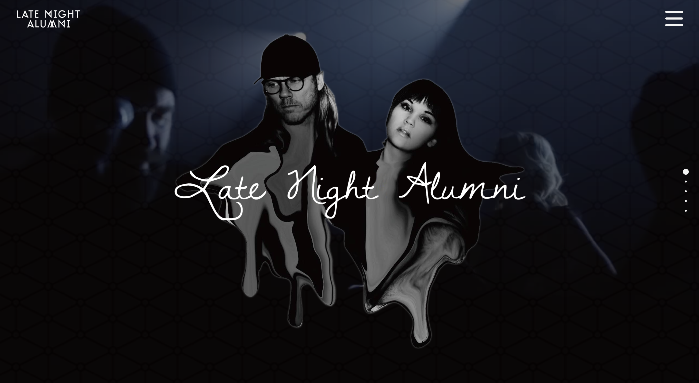

### Description

[Demo](https://late-night-alumni.web.app/)

One of my earliest web-design projects when I first learned front-end. Design-focused. Code is a mess.

A concept website made for one of my favorite band Late Night Alumni with pure css/html/jquery, utilizing the following plugins:
- Animate.css
- fullPage.js
- Masonry.js
- Gear Player

Not hooked up to any back-end functionality. Packed it up and hosted it via firebase.

Needs major refactoring and framework or webpack/gulp integration to bundle it.